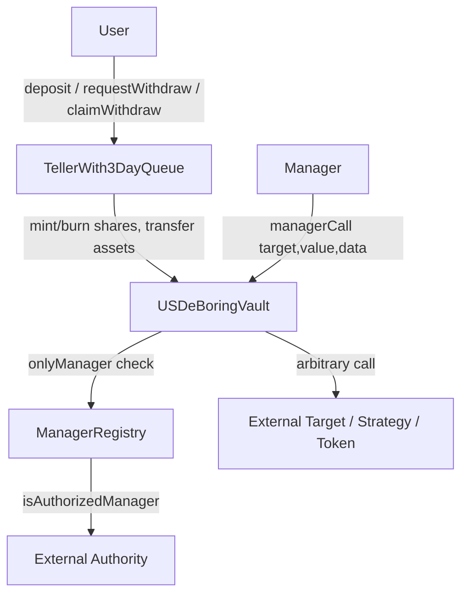

# Veda USDe Vault

## Quest

Use a Veda vault to:
- Deposit USDe and get your share of the vault's USDe in return
- Manager is a list of multiple addresses that can do anything with the assets (no restrictions)
- Manager addresses are added/removed based on an external authority address
- Implement a 3-day withdraw queue

## What We Built (Solution Summary)

This repo delivers an end-to-end Veda-style USDe vault implementation with:
- deposit -> share minting via teller + vault flow
- unrestricted manager actions through `managerCall`
- multi-manager authorization controlled by an external authority contract
- strict 3-day queue for withdrawals (early claim reverts, mature claim succeeds)

## Demo Videos

- **Web Interactive Demo**: https://youtu.be/gG992x0GUjo  
- **Terminal Full Run Demo**: https://youtu.be/_gmdjF8OuJ8

## Submission 

GitHub: `https://github.com/naitikrahane/VedaUsdvault`

Solution Explanation:
I built a Veda-style vault using `USDeBoringVault`, `TellerWith3DayQueue`, and `ManagerRegistry`.
Users deposit USDe through the teller and receive shares. Authorized managers can execute unrestricted external calls via `managerCall`, and manager permissions are sourced from an external authority (`SimpleManagerAuthority` in tests/demo). Withdrawals are forced into a strict 3-day queue, where early claim reverts and mature claim burns shares and returns USDe.

## Quest Requirement Answers

### 1) Deposit USDe and receive vault shares
- Implemented in `contracts/TellerWith3DayQueue.sol`
- Function: `deposit(uint256 assets, address receiver)`
- Behavior:
  - `asset.transferFrom(user, vault, assets)`
  - `vault.mintShares(receiver, shares)`

### 2) Manager is a list of multiple addresses that can do anything with assets
- Implemented in `contracts/USDeBoringVault.sol`
- Function: `managerCall(address target, uint256 value, bytes data)`
- Any authorized manager address can call arbitrary external targets with calldata.
- Multiple managers are supported (verified in `test/VedaUSDeVault.full.test.js`).
- No strategy-level restrictions are imposed by vault logic (except `target != 0` and `target != vault` safety checks).

### 3) Manager add/remove based on external authority address
- Implemented through `contracts/ManagerRegistry.sol`
- `USDeBoringVault.onlyManager` uses `managerRegistry.isAuthorizedManager(msg.sender)`
- `ManagerRegistry.isAuthorizedManager` delegates to external authority contract (`IManagerAuthority`)
- In demo/tests, external authority is `contracts/mocks/SimpleManagerAuthority.sol`
- Manager revoke is immediately enforced (verified in tests and demo output).

### 4) Implement a 3-day withdraw queue
- Implemented in `contracts/TellerWith3DayQueue.sol`
- Constant: `WITHDRAW_DELAY = 3 days`
- Flow:
  - `requestWithdraw(shares)` creates queue request with `unlockTimestamp`
  - `claimWithdraw` before maturity reverts with `RequestNotMatured`
  - after 3 days, claim burns shares and transfers USDe assets out

## Architecture Flowchart



## Withdraw Queue Flowchart

```mermaid
flowchart TD
    S[User has shares] --> Q[requestWithdraw(shares)]
    Q --> L[Request stored with unlockTimestamp = now + 3 days]
    L --> E{claim before unlock?}
    E -->|Yes| R1[Revert: RequestNotMatured]
    E -->|No| C[claimWithdraw]
    C --> B[Burn queued shares]
    B --> P[Transfer USDe assets to receiver]
    P --> D[Done]
```

## Contracts and Roles

| Contract | Responsibility |
|---|---|
| `USDeBoringVault.sol` | Vault custody, share accounting, manager unrestricted external calls |
| `TellerWith3DayQueue.sol` | User entrypoint for deposit and queued withdrawals |
| `ManagerRegistry.sol` | Manager authorization bridge to external authority |
| `SimpleManagerAuthority.sol` | External source of truth for add/remove manager (demo/test) |
| `MockUSDe.sol` | Mock USDe token for local execution |
| `MockStrategyTarget.sol` | Arbitrary target to prove unrestricted manager call behavior |

## Full Process (Start to Finish)

### 1. Prerequisites

- Node.js `>= 20`
- npm
- git

### 2. Install dependencies

```bash
npm install
```

### 3. Environment diagnostics

```bash
npm run doctor
```

### 4. Compile contracts

```bash
npm run compile
```

### 5. Run all tests

```bash
npm run test:all
```

### 6. Run full quest demo script

```bash
npm run demo
```

### 7. One-command full pipeline

```bash
npm run full:all
```

This runs: doctor -> compile -> all tests -> demo.

## Installer Kit

### Windows

```powershell
powershell -ExecutionPolicy Bypass -File .\installer-kit\install.ps1
```

### Windows + auto start web demo

```powershell
powershell -ExecutionPolicy Bypass -File .\installer-kit\install.ps1 -StartWebDemo
```

### macOS/Linux

```bash
bash ./installer-kit/install.sh
```

### macOS/Linux + auto start web demo

```bash
bash ./installer-kit/install.sh --start-web-demo
```

## Real Doctor Output (Captured)

Command:

```bash
npm run doctor
```

Output:

```text
> veda-usde-vault@1.0.0 doctor
> node scripts/doctor.js

Environment check:
[ok] Node.js: ok (v22.19.0)
[ok] npm: ok (11.6.2)
[ok] git: ok (git version 2.52.0.windows.1)
[ok] hardhat: ok (2.28.6)
```

## Real Demo Output (Captured)

Command:

```bash
npm run demo
```

Output:

```text
> veda-usde-vault@1.0.0 demo
> hardhat run scripts/fullDemo.js

== Deploying contracts ==
deployer: 0xf39Fd6e51aad88F6F4ce6aB8827279cffFb92266
alice:    0x70997970C51812dc3A010C7d01b50e0d17dc79C8
manager:  0x3C44CdDdB6a900fa2b585dd299e03d12FA4293BC
receiver: 0x90F79bf6EB2c4f870365E785982E1f101E93b906
== Mint + deposit ==
[ok] Alice deposited 100 USDe and received 100 shares
== Manager authorization checks ==
[ok] Unauthorized manager cannot call vault
[ok] Authorized manager executed unrestricted USDe transfer from vault
[ok] Authorized manager executed arbitrary strategy call
== 3-day withdraw queue ==
[ok] Cannot claim before 3-day queue maturity
[ok] Matured queue claimed; shares burned and USDe returned
== Revoke manager ==
[ok] Revoked manager loses access immediately
== Demo complete ==
Vault USDe balance: 54000000000000000000 wei
Alice share balance: 60000000000000000000 wei
Alice USDe balance: 936000000000000000000 wei
Receiver USDe balance: 10000000000000000000 wei
```

## Real Test Output (Captured)

Command:

```bash
npm run test:all
```

Output summary:

```text
Veda USDe Vault full flow
  3 passing

Veda-style USDe Vault
  5 passing

8 passing (main suite) + 3 passing (full suite rerun)
```

## Interactive Website Demo

Run:

```bash
npm run web:demo
```

Open:

```text
http://localhost:4173
```

Recommended UI flow:
1. Init / Create Vault
2. Deposit 100 USDe
3. Enable Manager
4. Manager Transfer 10 USDe
5. Request Withdraw 40 Shares
6. Try Early Claim (expected revert)
7. Advance 3 Days
8. Claim Withdraw
9. Revoke Manager
10. Manager Try After Revoke (expected revert)

## API Routes (Web Demo)

| Method | Route |
|---|---|
| `POST` | `/api/init` |
| `GET` | `/api/state` |
| `POST` | `/api/deposit` |
| `POST` | `/api/enable-manager` |
| `POST` | `/api/manager-transfer` |
| `POST` | `/api/request-withdraw` |
| `POST` | `/api/claim-early` |
| `POST` | `/api/advance-3days` |
| `POST` | `/api/claim-withdraw` |
| `POST` | `/api/revoke-manager` |
| `POST` | `/api/manager-after-revoke` |
| `POST` | `/api/run-full` |

## Security Notes

- `ReentrancyGuard` is used on teller flows and manager external call path.
- `onlyTeller` gates mint/burn/asset transfer hooks in vault.
- `onlyManager` gates unrestricted manager calls.
- Queue maturity is strictly timestamp-gated (`block.timestamp >= unlockTimestamp`).
- External authority decisions are consumed directly at call time through registry.

## Project Structure

```text
contracts/
  interfaces/
  mocks/
  utils/
  ManagerRegistry.sol
  TellerWith3DayQueue.sol
  USDeBoringVault.sol
test/
  VedaUSDeVault.test.js
  VedaUSDeVault.full.test.js
scripts/
  doctor.js
  fullDemo.js
  serve-site.js
  web-demo-server.js
installer-kit/
  install.ps1
  install.sh
website/
  index.html
  styles.css
  app.js
```

## NPM Scripts

- `npm run doctor`
- `npm run compile`
- `npm run test`
- `npm run test:full`
- `npm run test:all`
- `npm run demo`
- `npm run site`
- `npm run web:demo`
- `npm run full`
- `npm run full:all`

## Final Direct Response (Quest Format)

GitHub link: `https://github.com/naitikrahane/VedaUsdvault`

Explanation:
This repository implements a Veda-style USDe vault where users deposit USDe and receive vault shares, managers (multiple addresses) can execute unrestricted external calls through `managerCall`, manager permissions are controlled by an external authority contract through `ManagerRegistry`, and withdrawals are enforced through a strict 3-day queue in `TellerWith3DayQueue`. The behavior is validated with automated tests, a full CLI demo script, and an interactive web demo.

## License

MIT
